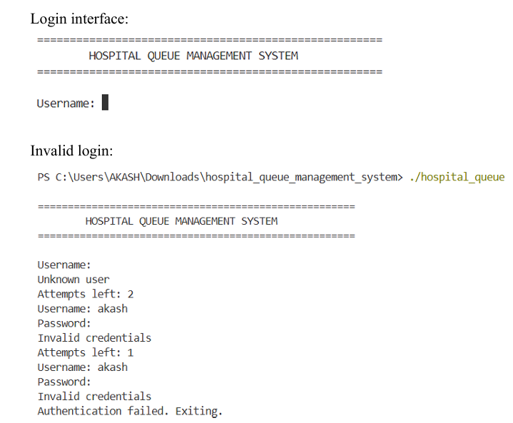
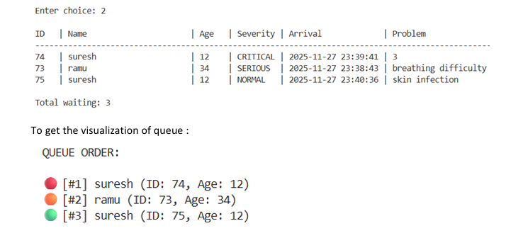
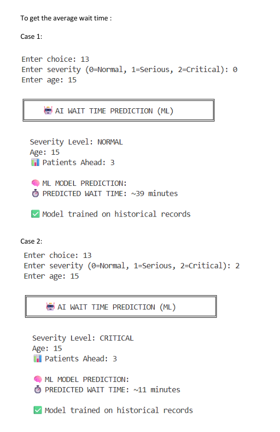

# Hospital Queue Management System (Priority Queue) - C (MVC)

**Description:**  
A simple hospital queue management system implemented in C using MVC architecture.  
It uses a linked-list based priority queue (higher severity first) and persists queue data to a CSV file.

## **Quick Start**

### **Prerequisites**
- GCC compiler installed
- Windows/Linux/macOS

### **Compile**
```bash
gcc -I./src -o hospital_queue src/main.c src/controller/controller.c src/auth/auth.c src/model/patient.c src/model/queue.c src/view/view.c src/util/time_util.c
```

### **Run**
```bash
./hospital_queue.exe
```

### **Login Credentials**

| Username | Password |
|----------|----------|
| `akash`  | (empty)  |
| `nitiin` | (empty)  |

**Note:** Just press Enter when prompted for password.

---

## Hospital Queue Management System — C (MVC)

A compact hospital queue management system implemented in C using a simple MVC-style layout. The app demonstrates linked-list priority queue logic (higher severity patients are served first), CSV persistence for queues and served history, and a text-based console UI.

This repository was built as a semester mini-project and is suitable for inclusion on a resume under Systems / C programming work.

**Highlights**
- Priority queue implemented in C (linked list)
- Patient registration, prioritized serving, search, and CSV persistence
- Simple analytics and served-history reporting
- Clean separation: `model`, `view`, `controller`, `auth`, `util`

Getting started
---------------

Prerequisites
- GCC or a compatible C compiler (MinGW on Windows is fine)
- Standard Unix tools or Windows terminal

Build (recommended)
```bash
# From repository root
make
```

Manual compile (single-command)
```bash
gcc -I./src -o hospital_queue.exe \
  src/main.c src/controller/controller.c src/auth/auth.c \
  src/model/patient.c src/model/queue.c src/view/view.c src/util/time_util.c
```

Run
```bash
./hospital_queue.exe
```

Authentication
- A simple demo `users.csv` is provided in `data/`. For the classroom/demo build the passwords are blank; press Enter when prompted.

Core features
- Register new patient (severity: 2=Critical, 1=Serious, 0=Normal)
- View and persist waiting list (`data/queue.csv`)
- Serve (dequeue) next patient and append to `data/served.csv`
- Search patients by ID or name
- View served history and average wait times by severity
- Additional analytics and utilities implemented in `controller.c`

Project layout
- `src/` — C source files
  - `auth/` — authentication helpers
  - `model/` — `patient` and `queue` implementations
  - `view/` — console UI helpers
  - `controller/` — application menu and workflows
  - `util/` — small helpers (time formatting)
- `data/` — CSV files used at runtime (`queue.csv`, `served.csv`, `users.csv`)
- `docs/` — project documentation and notes

Notes for reviewers / resume
- This project showcases low-level systems programming, data-structure implementation (priority queue), debugging across platform (Windows/Unix), and CSV persistence.
- If you want a short demo for interviews, run the program and show: register → view list → serve → view served history.


Project report
--------------
A detailed project report (design, workflow, flowcharts, and example outputs/screenshots) is included in `docs/report.md`. You can convert it to PDF for submission using `pandoc` or your editor's Print → Save as PDF feature; the target file for submissions should be `docs/report.pdf`.

To generate PDF with pandoc (optional):
```bash
# install pandoc if needed and a PDF engine like wkhtmltopdf or use LaTeX
pandoc docs/report.md -o docs/report.pdf --pdf-engine=pdflatex
```

License
- Add a LICENSE file if you want to publish this repository publicly.

Screenshots
-----------
Quick visual demo (images stored in `docs/screenshots/`):







